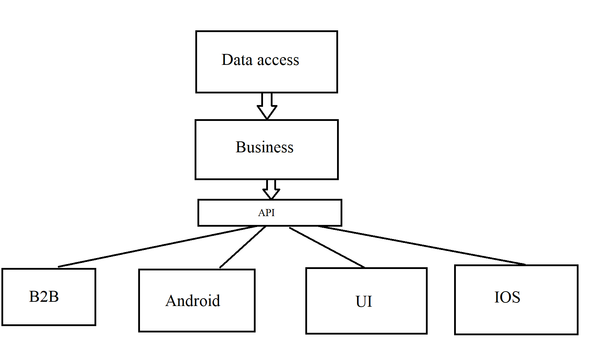
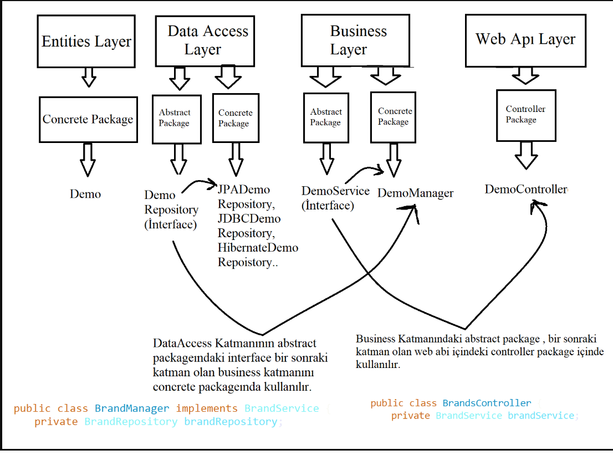

# 🚀 Spring Boot Projesi Nasıl Oluşturulur?

## 1. Proje Başlatma
İlk olarak [Spring Initializr](https://start.spring.io/) sitesine gidiyoruz.  
Burada proje yapılandırması için seçimler yapıyoruz:

- **Project:** Maven
- **Language:** Java
- **Spring Boot:** (Önerilen en güncel versiyon)


---

## 2. Bağımlılıkları (Dependencies) Eklemek
"Add Dependencies" butonuna basarak aşağıdaki bağımlılıkları ekliyoruz:

- Spring Boot DevTools
- Lombok
- Spring Web
- Spring Data JPA
- Validation
- PostgreSQL Driver

### 📚 Bu Bağımlılıklar Ne İşe Yarar?

- **Spring Boot DevTools (Developer Tools):**  
  Hızlı geliştirme için otomatik uygulama restart ve LiveReload sağlar.

- **Lombok (Developer Tools):**  
  `@Getter`, `@Setter` gibi anotasyonlarla Java’da tekrarlayan kod yazımını azaltır.

- **Spring Web (Web):**  
  Web uygulamaları ve REST API geliştirmek için kullanılır. İçinde Spring MVC ve gömülü Tomcat sunucusu bulunur.

- **Spring Data JPA (SQL):**  
  SQL yazmadan Java sınıfları ile veritabanı işlemleri yapmamızı sağlar. Arkada Hibernate çalışır.

- **Validation (I/O):**  
  Giriş verilerini doğrulamak için kullanılır (`@NotNull`, `@Size`, vs.).

- **PostgreSQL Driver (SQL):**  
  PostgreSQL veritabanına Java ile bağlantı kurmak için gerekli JDBC sürücüsüdür.

> **Not:** Bu bağımlılıklar `pom.xml` dosyası içinde bulunur.

---

## 3. Katmanlı Mimari (Layered Architecture)

Projeyi düzenli ve anlaşılır hale getirmek için katmanlı mimari kullanıyoruz.  
Bu mimaride her katman **tek bir işten sorumludur**.

### Kullanılan Katmanlar:

- Entities Layer
- Data Access Layer
- Business Layer
- Web API Layer

---



# 📦 Katmanlar ve Görevleri

## 1. Entities Layer (Entity Katmanı)
- Veritabanındaki tabloların Java sınıflarındaki karşılıkları burada bulunur.
- Sınıflar `@Entity` anotasyonu ile işaretlenir.
- Bu katmanda **sadece veri yapısı** tutulur, **iş mantığı (business logic)** olmaz.

**Örnek:**
```java
@Entity
public class User {
    private Long id;
    private String name;
    // getter ve setter metodları
}
```

---

## 2. Data Access Layer (DAL)
- Veritabanı işlemleri bu katmanda gerçekleştirilir.
- Repository veya DAO (Data Access Object) sınıfları burada yer alır.
- Genellikle Spring Data JPA kullanılıyorsa `@Repository` anotasyonu ile işaretlenir.

**Örnek:**
```java
@Repository
public interface UserRepository extends JpaRepository<User, Long> {
    // Özelleştirilmiş sorgular yazılabilir
}
```

---

## 3. Business Layer (Service Katmanı)
- Uygulamanın iş kuralları (business logic) burada bulunur.
- Genellikle `@Service` anotasyonu kullanılır.
- Veri erişimi ve iş mantığı burada birleştirilir.

**Örnek:**
```java
@Service
public class UserService {
    private final UserRepository userRepository;

    public UserService(UserRepository userRepository) {
        this.userRepository = userRepository;
    }

    public User createUser(User user) {
        return userRepository.save(user);
    }
}
```

---

## 4. Web API Layer (Controller Katmanı)
- Kullanıcıdan gelen HTTP isteklerini karşılar ve cevaplar.
- Genellikle `@RestController` anotasyonu kullanılır.
- Servis katmanıyla iletişim kurar ve sonuçları döner.

**Örnek:**
```java
@RestController
@RequestMapping("/api/users")
public class UserController {
    private final UserService userService;

    public UserController(UserService userService) {
        this.userService = userService;
    }

    @PostMapping
    public ResponseEntity<User> createUser(@RequestBody User user) {
        User createdUser = userService.createUser(user);
        return ResponseEntity.ok(createdUser);
    }
}
```

---

# 🎯 Abstract ve Concrete Paket Yapısı

Her katmanda iki alt paket bulunur:

| Paket | Açıklama |
| :--- | :--- |
| **abstract** | Interface veya abstract class'lar bulunur. Sadece **sözleşme** veya **şablon** tanımlar. |
| **concrete** | Interface veya abstract class'ların **gerçek implementasyonları** bulunur. |

---

# 🌟 Neden Abstract ve Concrete Ayrımı Yapılır?

- 🔄 İleride farklı bir implementasyon gerektiğinde **sadece concrete kısmı değiştirmek** yeterli olur.
- 🧪 Test yazarken **kolayca mock sınıflar** oluşturulabilir.
- 🔗 **Bağımlılıklar azalır**, proje daha **esnek** hale gelir.
- 📈 **Dependency Injection (Bağımlılık Enjeksiyonu)** prensibine uygun çalışır.

