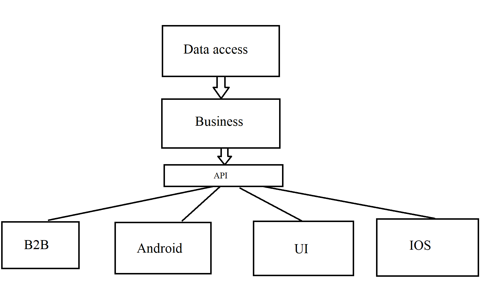
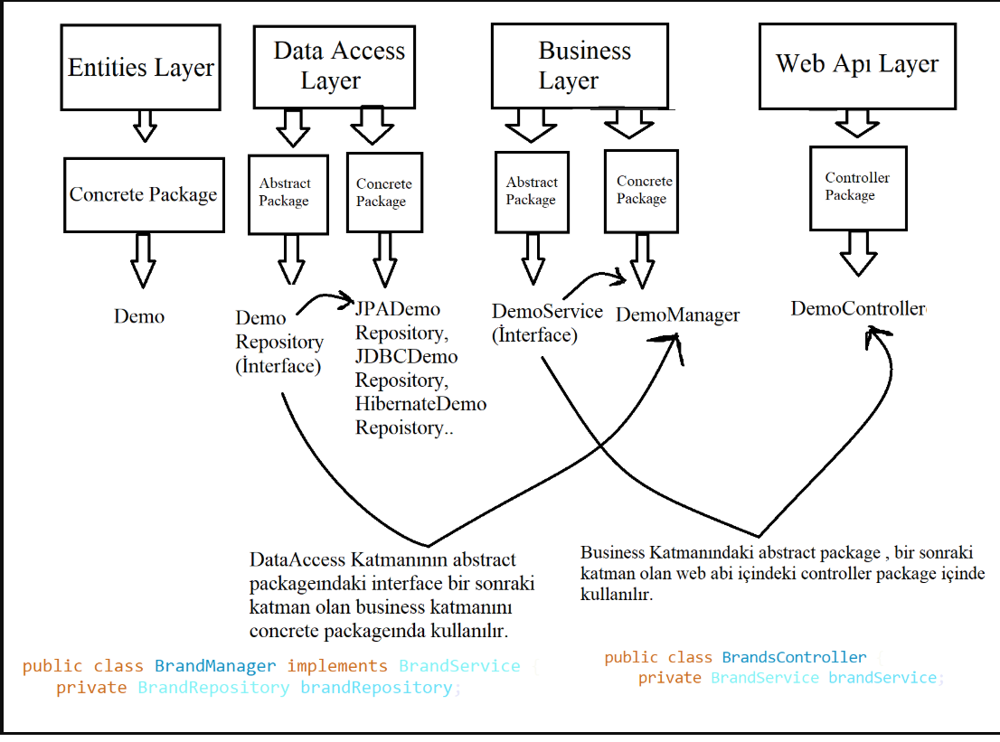

# 🚀 Spring Boot Projesi Nasıl Oluşturulur?

## 1. Proje Başlatma
İlk olarak [Spring Initializr](https://start.spring.io/) sitesine gidiyoruz.  
Burada proje yapılandırması için seçimler yapıyoruz:

- **Project:** Maven
- **Language:** Java
- **Spring Boot:** (Önerilen en güncel versiyon)


---

## 2. Bağımlılıkları (Dependencies) Eklemek
"Add Dependencies" butonuna basarak aşağıdaki bağımlılıkları ekliyoruz:

- Spring Boot DevTools
- Lombok
- Spring Web
- Spring Data JPA
- Validation
- PostgreSQL Driver

### 📚 Bu Bağımlılıklar Ne İşe Yarar?

- **Spring Boot DevTools (Developer Tools):**  
  Hızlı geliştirme için otomatik uygulama restart ve LiveReload sağlar.

- **Lombok (Developer Tools):**  
  `@Getter`, `@Setter` gibi anotasyonlarla Java’da tekrarlayan kod yazımını azaltır.

- **Spring Web (Web):**  
  Web uygulamaları ve REST API geliştirmek için kullanılır. İçinde Spring MVC ve gömülü Tomcat sunucusu bulunur.

- **Spring Data JPA (SQL):**  
  SQL yazmadan Java sınıfları ile veritabanı işlemleri yapmamızı sağlar. Arkada Hibernate çalışır.

- **Validation (I/O):**  
  Giriş verilerini doğrulamak için kullanılır (`@NotNull`, `@Size`, vs.).

- **PostgreSQL Driver (SQL):**  
  PostgreSQL veritabanına Java ile bağlantı kurmak için gerekli JDBC sürücüsüdür.

> **Not:** Bu bağımlılıklar `pom.xml` dosyası içinde bulunur.

---

## 3. Katmanlı Mimari (Layered Architecture)

Projeyi düzenli ve anlaşılır hale getirmek için katmanlı mimari kullanıyoruz.  
Bu mimaride her katman **tek bir işten sorumludur**.

### Kullanılan Katmanlar:

- Entities Layer
- Data Access Layer
- Business Layer
- Controller(Web API) Layer

---



# 📦 Katmanlar ve Görevleri

## 1. Entities Layer (Entity Katmanı)
- Veritabanındaki tabloların Java sınıflarındaki karşılıkları burada bulunur.
- Sınıflar `@Entity` anotasyonu ile işaretlenir.
- Bu katmanda **sadece veri yapısı** tutulur, **iş mantığı (business logic)** olmaz.

**Örnek:**
```java
@Entity
public class User {
    private Long id;
    private String name;
    // getter ve setter metodları
}
```

---

## 2. Data Access Layer (DAL)
- Veritabanı işlemleri bu katmanda gerçekleştirilir.
- Repository veya DAO (Data Access Object) sınıfları burada yer alır.
- Genellikle Spring Data JPA kullanılıyorsa `@Repository` anotasyonu ile işaretlenir.

**Örnek:**
```java
@Repository
public interface UserRepository extends JpaRepository<User, Long> {
    // Özelleştirilmiş sorgular yazılabilir
}
```

---

## 3. Business Layer (Service Katmanı)
- Uygulamanın iş kuralları (business logic) burada bulunur.
- Genellikle `@Service` anotasyonu kullanılır.
- Veri erişimi ve iş mantığı burada birleştirilir.

**Örnek:**
```java
@Service
public class UserService {
    private final UserRepository userRepository;

    public UserService(UserRepository userRepository) {
        this.userRepository = userRepository;
    }

    public User createUser(User user) {
        return userRepository.save(user);
    }
}
```

---

## 4. Web API Layer (Controller Katmanı)
- Kullanıcıdan gelen HTTP isteklerini karşılar ve cevaplar.
- Genellikle `@RestController` anotasyonu kullanılır.
- Servis katmanıyla iletişim kurar ve sonuçları döner.

**Örnek:**
```java
@RestController
@RequestMapping("/api/users")
public class UserController {
    private final UserService userService;

    public UserController(UserService userService) {
        this.userService = userService;
    }

    @PostMapping
    public ResponseEntity<User> createUser(@RequestBody User user) {
        User createdUser = userService.createUser(user);
        return ResponseEntity.ok(createdUser);
    }
}
```

---

# 🎯 Abstract ve Concrete Paket Yapısı

Her katmanda iki alt paket bulunur:

| Paket | Açıklama |
| :--- | :--- |
| **abstract** | Interface veya abstract class'lar bulunur. Sadece **sözleşme** veya **şablon** tanımlar. |
| **concrete** | Interface veya abstract class'ların **gerçek implementasyonları** bulunur. |

---

# 🌟 Neden Abstract ve Concrete Ayrımı Yapılır?

- 🔄 İleride farklı bir implementasyon gerektiğinde **sadece concrete kısmı değiştirmek** yeterli olur.
- 🧪 Test yazarken **kolayca mock sınıflar** oluşturulabilir.
- 🔗 **Bağımlılıklar azalır**, proje daha **esnek** hale gelir.
- 📈 **Dependency Injection (Bağımlılık Enjeksiyonu)** prensibine uygun çalışır.

## 🔧 ModelMapper Nedir?

ModelMapper, Java Spring Boot projelerinde kullanılan bir **nesne dönüştürme (object mapping)** kütüphanesidir. Temel amacı, bir nesnedeki verileri başka bir nesneye otomatik ve kolay şekilde kopyalamaktır. Özellikle DTO (Data Transfer Object) ile Entity sınıfları arasında dönüşüm yaparken oldukça kullanışlıdır.

### 📌 Ne İşe Yarar?

- 🔄 Entity – DTO dönüşümünü kolaylaştırır.  
- ✂️ Gereksiz getter-setter, manuel kopyalama kodlarını azaltır.  
- 📦 Kodun daha temiz, okunabilir ve sürdürülebilir olmasını sağlar.  
- 🔍 Alan isimleri aynıysa otomatik eşleştirme yapar.  
- 🧩 Gerekirse özel eşleştirme (custom mapping) yapılabilir.

### 💡 Kullanım Senaryoları

- `UserEntity` sınıfından `UserDTO` sınıfına veri aktarımı
- Formdan gelen `CreateUserRequest` nesnesini `UserEntity`'ye dönüştürme işlemi

---

## ⚙️ Kurulum

### 1. Maven Bağımlılığı

```xml
<dependency>
    <groupId>org.modelmapper</groupId>
    <artifactId>modelmapper</artifactId>
    <version>3.1.1</version>
</dependency>
```

---

## 🧩 Bean Tanımı (Spring Boot)

Spring'de `ModelMapper`'ı kullanmadan önce bir **bean** olarak tanımlanması gerekir.

### ✅ Neden Bean Olarak Tanımlarız?

Spring'de bir sınıfı `@Bean` ile tanımlamak, bu nesnenin Spring tarafından yönetilmesini sağlar. Böylece her yerde otomatik olarak (`@Autowired` ile) kullanılabilir hale gelir.

### 📦 Avantajları:

- Tek bir `ModelMapper` nesnesi kullanılır (singleton)
- Her yerde yeniden oluşturmak gerekmez
- Özelleştirmeler merkezi olarak yapılabilir

### 🛠️ Bean Tanımı:

`Application.java` ya da bir `@Configuration` sınıfı içerisine aşağıdaki kod eklenir:

```java
@Bean
public ModelMapper getModelMapper() {
    return new ModelMapper();
}
```

---

Artık `ModelMapper` sınıfını aşağıdaki gibi projede kullanabilirsin:

```java
@Autowired
private ModelMapper modelMapper;

public UserDTO convertToDto(UserEntity user) {
    return modelMapper.map(user, UserDTO.class);
}
```

> 🔁 Bu yapı sayesinde kod tekrarı azalır, temiz ve sürdürülebilir bir mimari elde edilir.


Spring Boot projelerinde `business/requests` ve `business/responses` paketlerinin kullanılmasının temel amacı, **katmanlı mimaride veri akışını net bir şekilde ayırmak ve kontrol altına almaktır**. Bu yapı, özellikle kurumsal ve büyük projelerde kodun okunabilirliğini, sürdürülebilirliğini ve güvenliğini artırır.

---

## 📦 Neden `requests` ve `responses` paketleri var?

### 1. **Veri Girişini ve Çıkışını Ayırmak (Separation of Concerns)**

- `requests`: Dışarıdan (örneğin bir kullanıcıdan veya başka bir API'den) gelen **verileri temsil eder**. Örnek: `CreateBrandRequest`, `UpdateBrandRequest`
- `responses`: Kullanıcıya ya da başka servislere **geri döndürülen verileri temsil eder**. Örnek: `GetAllBrandsResponse`, `GetByIdBrandResponse`

Bu ayrım, hem frontend hem de backend için **veri kontrolünü kolaylaştırır**.

---

### 2. **Veri Gizliliği ve Güvenlik**

Entity sınıflarınız (örneğin `Brand`) veritabanıyla birebir eşleşir. Ancak her alanı kullanıcıya göstermek ya da dışarıdan almak istemeyebilirsin.  
Örneğin:

```java
// Entity'de olabilir:
private Long id;
private String name;
private LocalDateTime createdAt;
private String createdBy;
```

Ama bir `GetAllBrandsResponse`'da sadece şunu döndürmek isteyebilirsin:
```java
private Long id;
private String name;
```

Bu sayede kullanıcıya gereksiz ya da hassas veri sunulmamış olur.

---

### 3. **API Dökümantasyonu ve Sözleşmesi Kolaylaşır**

Swagger gibi araçlar sayesinde, `CreateBrandRequest` veya `GetAllBrandsResponse` gibi sınıflar otomatik dökümantasyon sağlar.  
Ayrı sınıflar sayesinde **API daha anlaşılır olur.**

---

### 4. **Kodun Genişletilmesi ve Bakımı Kolaylaşır**

Yeni alanlar eklendiğinde ya da farklı işlemler (create, update vs.) için özel alanlar gerektiğinde, entity'yi değiştirmek yerine sadece ilgili request/response sınıfını düzenlemen yeterlidir.

---

### 🔄 DTO - Entity Dönüşümü (ModelMapper ile)

Bu yapının avantajı, az önce incelediğimiz `ModelMapperService` ile de ortaya çıkar:

```java
Brand brand = modelMapperService.forRequest().map(createBrandRequest, Brand.class);
GetAllBrandsResponse dto = modelMapperService.forResponse().map(brand, GetAllBrandsResponse.class);
```

---

### 🔍 Özetle

| Amaç | Açıklama |
|------|----------|
| **Katman ayrımı** | Veri giriş (request) ve çıkışını (response) ayırmak |
| **Güvenlik** | Gereksiz/hassas verileri gizlemek |
| **Temizlik** | Kodun okunabilirliğini ve bakımını kolaylaştırmak |
| **Dökümantasyon** | Swagger gibi araçlarla uyumlu, açık API tasarımı |
| **Esneklik** | Farklı operasyonlar için özelleştirilmiş veri modelleri |

---

## Neden `Model` kullanılır, `Brand` değil?

Gerçek hayattaki ilişkiyi düşün:

* Arabanın modeli: *Toyota Corolla*
* Markası: *Toyota*

Ancak:

* Bir arabanın markası tek başına **yetersiz** bir bilgidir. "Toyota" marka diyerek arabayı tarif edemezsin.
* Ama "Corolla" modeli (ve bu modelin zaten bir markası var) arabayı tanımlamak için yeterlidir.

### Bu yüzden:

```java
@ManyToOne
@JoinColumn(name = "model_id")
private Model model;
```

Model zaten içinde şu şekilde Brand bilgisi barındırır:

```java
@ManyToOne
@JoinColumn(name = "brand_id")
private Brand brand;
```

Yani dolaylı olarak:

**Car → Model → Brand**

Şeklinde bir zincir olur. Böylece her `Car` nesnesi hem model hem de marka bilgisine sahiptir ama **veritabanında fazladan foreign key tutmadan** bu ilişki kurulmuş olur. Bu da doğru veri modelleme açısından en iyi yaklaşımdır.

### Özetle:

* `Car` doğrudan bir `Model`’e bağlıdır.
* `Model` ise bir `Brand`’e bağlıdır.
* Bu yapı hem sade hem de gerçek dünyayı en doğru şekilde yansıtır.

## ❌ Hata: Brand Silinemiyor (Foreign Key Constraint)

### 🧾 Hata Mesajı:

```txt
ERROR: update or delete on table "brands" violates foreign key constraint "fk..." on table "models"
Detail: Key (id)=(1) is still referenced from table "models".
```

### 📌 Sebep:

`brands` tablosundaki bir kaydı silmeye çalışıyorsun. Ancak bu kaydı `models` tablosundaki kayıtlar hâlâ kullanıyor. Veritabanı, referanslı veri kaybolmasın diye silme işlemine izin vermiyor.

---

## ✅ Çözüm Yolları:

### 1. Önce Bağlı Modelleri Sil

```java
modelRepository.deleteAllByBrandId(1);
brandRepository.deleteById(1);
```

> `deleteAllByBrandId(int id)` metodunu `ModelRepository` içerisine yazmalısın.

---

### 2. Cascade Delete Kullan

Marka silinince, bağlı modellerin de otomatik silinmesini istiyorsan:

```java
@OneToMany(mappedBy = "brand", cascade = CascadeType.ALL, orphanRemoval = true)
private List<Model> models;
```

> Bu ilişkiyi `Brand` entity’sinde tanımla.

---

### 3. Kullanıcıyı Uyar ve Silme

Silme işleminden önce marka ile ilişkili model var mı diye kontrol et:

```java
if (modelRepository.existsByBrandId(brandId)) {
    throw new BusinessException("Bu markaya bağlı modeller olduğu için silinemez.");
}
```

> `existsByBrandId(int id)` methodunu `ModelRepository` içinde tanımla.

---

## 📌 Hangi Yöntemi Seçmeliyim?

| İhtiyacın                                  | Kullanman Gereken                      |
| ------------------------------------------ | -------------------------------------- |
| Modeller de silinsin                       | CascadeType.ALL ve orphanRemoval       |
| Önce modeller silinip sonra marka silinsin | Servis katmanında önce modelleri sil   |
| Silmeye izin verilmesin                    | Kullanıcıya uyarı ver, silmeyi engelle |

---

İsteğine göre yukarıdaki üç yöntemden birini uygulayabilirsin.


